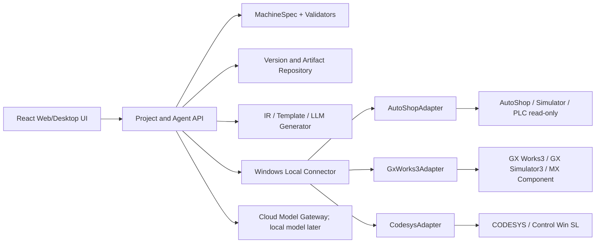

# Development Roadmap

## 1. 总体策略

先用固定示例数据做完整可点击 Demo，确认页面、术语、流程和信息密度；再保持同一 UI，逐层替换为真实 Excel、版本库、代码生成、厂商编译、模拟和在线监控能力。

产品不把厂商软件重新实现到 Web 中。Agent 是统一前台和编排层，Windows 本地 Connector/Adapter 调用用户自行安装的 AutoShop、GX Works3、CODESYS 和模拟器。

## 2. 目标架构



## 3. 推荐技术栈

- 前端：React、TypeScript、Vite；
- UI 状态：TanStack Query + 轻量本地状态；
- 流程/拓扑：React Flow 或等价图形组件；
- 表格：支持大表、单元格错误和定位的 Data Grid；
- 代码：Monaco Editor；
- 时序/节拍：ECharts 或等价图表；
- API：Python 3.12、FastAPI、Pydantic v2；
- Excel：openpyxl 读取/生成，JSON Schema/Pydantic 做规范校验；
- 数据库：开发期 SQLite，进入多用户试点后 PostgreSQL；
- 版本：Git 管理文本/JSON，工件目录或对象存储保存厂商二进制和报告；
- Agent：显式工作流状态机，云端 OpenAI-compatible 模型网关；
- 本地连接器：Windows 常驻进程，统一 Adapter 接口；
- 测试：pytest、前端组件测试、E2E 点击测试、Adapter 契约测试。

首版不强制 Tauri。先用浏览器 UI + 本机服务完成；需要一键安装和本地进程管理时再用 Tauri/安装器封装。

## 4. 统一 Adapter 契约

每个 Adapter 按能力声明而不是假装功能齐全：

```text
detect_environment
get_capabilities
prepare_workspace_copy
import_or_apply_program
compile
get_diagnostics
open_in_vendor_ide
start_simulation
stop_simulation
write_simulation_inputs
read_variables
get_trace
connect_read_only
disconnect
export_vendor_project
```

能力状态：supported、manual、experimental、unsupported。真实 PLC 写入、下载、RUN/STOP、强制输出不出现在首版契约中。

## 5. 交付阶段

### D0. 示例数据与导航骨架

**目标**：建立一套贯穿所有页面的脱敏示例项目。

**产出**

- 项目、PLC、MachineSpec、代码、错误、测试、Release、在线变量等 fixtures；
- 全局导航、项目头部、状态颜色和演示数据标识；
- P01–P12 空页面与路由；
- Demo 场景切换器。

**完成定义**：所有页面能到达，返回路径明确，版本信息一致。

### D1. 可点击 Demo

**目标**：完整演示 PRD-001 的用户旅程，不调用真实 Excel、模型或厂商软件。

**页面顺序**

1. P01 项目列表；
2. P02 创建项目/环境；
3. P03 模板中心；
4. P04 上传检查；
5. P05 多视图审阅；
6. P06 程序工作区；
7. P07 编译失败与修复；
8. P08 模拟失败与通过；
9. P09 发布评审；
10. P10 在线只读监控；
11. P11 版本中心；
12. P12 环境设置。

**完成定义**

- 正常流程可以从头点击到尾；
- 至少覆盖 Excel 错误、编译失败、模拟失败、发布退回和版本恢复分支；
- 每个按钮都有反馈，不出现无响应占位；
- 机械和电气工程师能指出页面术语和信息层级问题；
- Demo 明确标识为模拟数据。

### M1. MachineSpec 与 Excel MVP

**目标**：把 P03–P05 替换为真实模板、解析、校验和视图。

**产出**

- 人机共创定稿的 Excel v1；
- 模板生成与项目元数据写入；
- Excel 导入、原文件保存和导入版本；
- 结构/类型/引用/工程规则检查；
- 页面表格修正和问题定位；
- MachineSpec JSON Schema、版本与迁移；
- 设备树、流程、节拍、时序、I/O 和互锁视图；
- 规格锁定。

**测试门**：用黄金项目完整迁移，预埋错误可被发现，视图与工程师理解一致。

### M2. 仓库与程序生成 MVP

**目标**：把 P06、P11 替换为真实版本与生成物。

**产出**

- 项目、分支、Commit、Release 数据模型；
- Git 文本仓库和二进制工件快照；
- MachineSpec → 类型化控制 IR；
- 首批气缸、简单伺服/变频器、状态机、模式和监控变量模板；
- TestSpec 生成；
- ST 编辑器、程序树、步骤实现、变量、追踪和差异；
- 云端模型用于结构化补全和限定补丁；
- 安全边界和关键缺失拦截。

**测试门**：重复输入产生稳定的确定性骨架；每次 AI 修改可恢复；未填写报警不阻断。

### M3. 首个厂商编译 Adapter

**选择门**

- 优先做目标市场更匹配的 AutoShop/H5U 技术 spike；
- 如果无法稳定获得编译诊断或许可不可接受，先实现 GX Works3/FX5U；
- CODESYS/Control Win SL 作为实验后端，不依赖收费 PDE。

**产出**

- Windows Local Connector；
- 环境检测与能力声明；
- 工程副本、程序导入、编译、日志和诊断定位；
- 人工降级模式；
- Adapter 契约测试和版本锁定；
- P02、P07、P12 接真实数据。

**测试门**：同一示例连续多次编译结果一致；失败不损坏原工程；程序/配置/环境错误可区分。

### M4. 模拟闭环

**目标**：把 P08 替换为真实模拟后端。

**路线**

- 三菱：GX Simulator3，优先借助官方通信组件读写模拟变量；
- 汇川：AutoShop 模拟模式，按实测 Adapter 能力；
- CODESYS：内置 Simulation 或 Control Win SL；不依赖收费 PDE。

**产出**

- 模拟会话隔离；
- TestSpec 执行器；
- 简单气缸/轴反馈模型；
- 虚拟输入、输出、工步和 Trace；
- 正常/异常测试、手动模拟；
- 失败定位与报告；
- 真实 PLC 防误写检查。

**测试门**：故意翻转条件或删除互锁后，相关测试必须失败；新 Commit 不继承旧测试结果。

### M5. 发布与真实 PLC 在线只读监控

**产出**

- Release 评审和交付包；
- MANIFEST、变更说明和版本恢复；
- 用户在厂商 IDE 手工下载后的只读连接；
- Watch List、工步、I/O、变量和 Trace；
- 本地数据窗口整理和云端模型分析；
- 从现场证据创建调试分支。

**测试门**：首版产品中不存在真实 PLC 写入入口；项目/变量版本不匹配时拒绝确定性分析。

## 6. 开发优先级

### P0

- P01–P12 可点击 Demo；
- MachineSpec 模板和导入；
- 多视图确认；
- Git 式版本/差异/恢复；
- 一个厂商编译与模拟闭环；
- 在线只读监控。

### P1

- 第二厂商 Adapter；
- 更丰富的 LD 渲染和交叉引用；
- 更多标准机构模板；
- 多人审批与权限；
- 人工 IDE 修改自动读回。

### P2

- Fault Diagnosis Center；
- 边缘采集盒；
- 企业本地模型；
- 外部数字孪生；
- AutomationML/PLCopen XML 交换增强。

## 7. 推荐代码目录

```text
apps/
├── web/
└── local-connector/
services/
├── api/
├── agent/
├── generator/
├── validator/
├── test-runner/
└── artifact-service/
packages/
├── machine-spec/
├── control-ir/
├── ui-components/
├── adapter-contract/
└── template-packs/
adapters/
├── autoshop/
├── gxworks3/
└── codesys/
fixtures/
├── demo-project/
└── error-scenarios/
docs/
└── ...
```

## 8. 开发过程不可违反的规则

- 不在没有真实验证时把 Adapter 能力标成 supported；
- 不让 AI 直接覆盖 Release 或现场工程；
- 不让编译/模拟通过状态跨 Commit 继承；
- 不把普通流程图冒充真实梯形图；
- 不在真实 PLC 连接中复用模拟器写入工具；
- 不把客户高频原始数据未经选择直接发给云端模型；
- 不在首版生成安全控制逻辑；
- 不因 Demo 需要而伪造“已接通厂商接口”的宣传。

## 9. 开发启动输入

开始实现真实能力前，需要用户准备：

1. 一个脱敏黄金项目；
2. 现有机电对接表、I/O 表和动作/节拍表；
3. 对应 PLC 工程和使用的软件版本；
4. 一个可用于模拟/测试的 PLC 型号；
5. 用户与电气伙伴共同评审 MachineSpec 模板；
6. 确认首个真实 Adapter 是 AutoShop/H5U 还是 GX Works3/FX5U。

