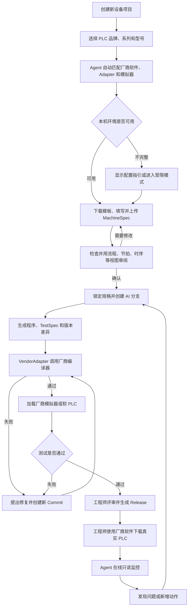
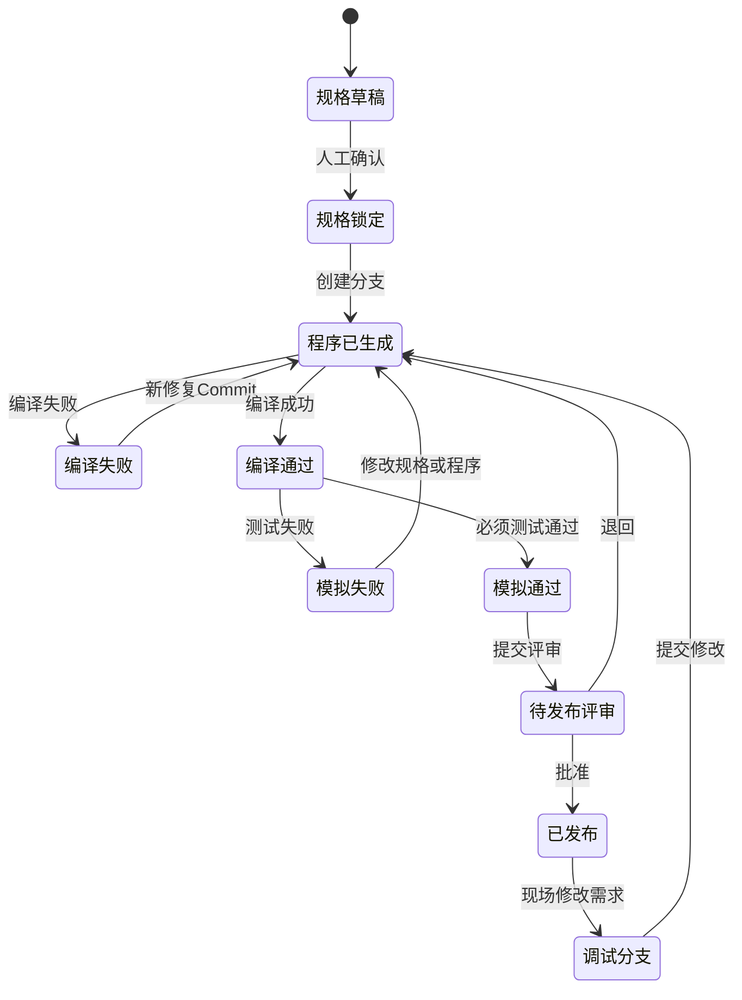

# 产品需求文档：PLC Engineering Agent MVP - V1.0

> 工作名称，正式产品名待定。本文是第一版开发与可点击 Demo 的需求基线。  
> 更新时间：2026-08-27  
> 状态：可进入 Demo 设计与开发；MachineSpec Excel 字段规范待专项共创。

## 1. 综述（Overview）

### 1.1 项目背景与核心问题

非标自动化项目中，机械工程师通常通过机电对接表、I/O 资料、动作顺序和节拍向电气工程师交接。资料格式依赖个人习惯，程序中的重复结构多，编译、模拟、现场修改又分散在 AutoShop、GX Works3、CODESYS 等厂商软件中。AI 可以帮助生成和分析 PLC 程序，但若缺少统一输入、厂商编译器、模拟测试和版本控制，很容易出现“代码看起来正确、实际不可编译或修改后破坏旧逻辑”的问题。

本产品先解决两块：

- **区域 A：New Machine Programming**——从统一设备规格生成普通 PLC 逻辑、测试和厂商交付物；
- **区域 B：Engineering Debug Workbench**——联动本机厂商软件进行编译、模拟、差异评审、版本管理和真实 PLC 在线只读监控。

区域 C“Fault Diagnosis Center”后续单独建设，本 PRD 只预留数据和版本接口。

### 1.2 产品目标

1. 让机械、电气工程师使用统一 Excel 模板表达设备和动作要求；
2. 在生成代码前通过流程、节拍、信号时序等视图确认 Agent 理解正确；
3. 生成可查看、可编辑、可追踪的 ST/LD、变量、测试和厂商工程包；
4. 用户在 Agent 中一键触发本机编译和模拟，实际执行由厂商软件或软 PLC 完成；
5. AI 和人工的每次修改均形成分支、提交、差异和可恢复版本；
6. 工程师通过厂商软件下载程序后，Agent 可连接真实 PLC 做在线只读监控；
7. 第一阶段先交付完整可点击 Demo，再按相同页面逐步接入真实能力。

### 1.3 第一版范围

- 项目列表、项目创建、PLC 品牌/系列/型号选择；
- 自动匹配本机厂商软件、Adapter、模拟器和监控能力；
- 官方 Excel 模板范例、下载、上传、检查和交互修正；
- MachineSpec 多视图审阅与锁定；
- AI 分支、代码/TestSpec 生成和程序工作区；
- 厂商编译、错误回读、差异批准与重新编译；
- 厂商模拟器/Windows 软 PLC 自动测试和手动模拟；
- 发布评审、交付包、历史版本和恢复；
- 工程师手工下载后的真实 PLC 在线只读监控；
- 云端大模型优先，模型接口保留本地替换能力。

### 1.4 非目标

- 不自动生成或修改安全 PLC、急停、门锁、光栅等安全功能；
- 不自动向真实 PLC 下载程序，不控制真实 PLC RUN/STOP，不强制真实输出；
- 不把 ST 任意无损转换成梯形图；按目标平台能力生成真实 ST、LD 或可验证工程对象；
- 不在第一版实现完整机械数字孪生、动力学仿真或 SolidWorks 自动建模；
- 不在第一版实现故障诊断中心、边缘盒、企业离线模型和预测性维护；
- 不以收费 CODESYS Professional Developer Edition 为首版必选依赖；
- 报警/异常表为选填，不因缺少完整报警系统阻止首版程序生成。

### 1.5 用户角色

- **机械/工艺工程师**：准备机构、动作、节拍资料，审阅流程和时序；
- **PLC/电气工程师**：确认 PLC、I/O、程序、编译、模拟和发布；
- **项目负责人**：决定基线和发布；小团队中同一人可兼任；
- **系统维护者**：维护模板、兼容矩阵、Adapter 和模型配置。

### 1.6 核心术语

- `MachineSpec`：由官方 Excel 归一化而来的版本化设备规格；
- `VendorAdapter`：封装 AutoShop、GX Works3、CODESYS 等本机工具差异的连接层；
- `TestSpec`：从 MachineSpec 同源生成的模拟测试规格；
- `Commit`：一次不可变的规格、代码或工程修改记录；
- `Release`：通过评审的正式交付版本；
- `真实 PLC 在线只读`：允许读取变量和 Trace，不允许 Agent 写入或下载。

## 2. 核心用户旅程

### 2.1 阶段地图

1. 项目创建与目标 PLC 选择；
2. 下载、填写并上传官方 Excel；
3. 自动检查与交互修正；
4. 多视图确认 MachineSpec 并锁定；
5. 创建 AI 分支并生成程序和 TestSpec；
6. 调用本机厂商软件编译并修复；
7. 调用模拟器或软 PLC 执行测试；
8. 工程师评审、合并和生成发布包；
9. 工程师手工下载真实 PLC；
10. Agent 在线只读监控，发现修改需求后重新进入分支闭环。

### 2.2 用户操作主流程



### 2.3 版本状态机



## 3. 用户故事（User Stories）

### 阶段一：项目与资料

---

#### US-01：作为 PLC 工程师，我希望选择 PLC 型号并自动匹配本机环境，以便创建正确目标的项目

**业务逻辑**

1. 必填项目名称、PLC 品牌、系列和型号；用户不选择 Connector/MCP。
2. 系统从兼容矩阵自动匹配厂商软件、Adapter、模拟器和在线监控能力。
3. 环境不完整仍可保存和录入资料，但编译、模拟或监控能力按实际禁用。
4. 可点击 Demo 使用模拟检测状态；真实检测在后续 MVP 接入。

**异常路径**：型号未适配、软件未安装、多个版本、检测失败和型号更换均保留项目资料并给出明确能力降级。

**验收**

- GIVEN 选择已支持型号，WHEN 环境可用，THEN 允许进入资料流程；
- GIVEN 软件缺失，WHEN 检测结束，THEN 显示安装指引且禁用对应动作；
- GIVEN 型号未适配，THEN 允许建立资料项目但不宣称可编译模拟。

```text
+--------------------------------------------------------------------------------+
| 新建设备项目                                                       [项目列表] |
+--------------------------------------------------------------------------------+
| 项目名称 [____________________]  品牌 [三菱 v] 系列 [FX5U v] 型号 [______ v]   |
+--------------------------------------+-----------------------------------------+
| 目标平台摘要                         | 本机环境                                |
| PLC / 软件 / 语言                    | 工程软件 [已检测] 模拟器 [可用]         |
| 自动匹配 Adapter                     | PLC连接 [未连接] [重新检查]             |
+--------------------------------------+-----------------------------------------+
| [取消]                  [保存草稿]                  [创建并继续 →]             |
+--------------------------------------------------------------------------------+
```

---

#### US-02：作为工程师，我希望查看范例并下载官方 Excel，以便按统一规范准备资料

**业务逻辑**

1. 页面展示必填/选填工作表、用途、示例和填写注意事项。
2. 提供“空白工程模板”和明显标记的“完整填写范例”。
3. 模板绑定项目、PLC 目标、MachineSpec 和模板版本。
4. 第一版只接受官方模板；具体字段、代码命名和枚举另行共创定稿。

**异常路径**：未选型号不能下载；目标改变后旧模板过期；范例文件不能作为正式输入。

**验收**：可预览每张表，下载文件包含 Instructions、Project、Components、Signals、Sequence 及选填 Interlocks、Exceptions。

```text
+--------------------------------------------------------------------------------------+
| 设备资料 / 下载模板      PLC：FX5U      MachineSpec：V1.0      模板：V1.0            |
+-------------------------------+------------------------------------------------------+
| 工作表                         | 字段说明与填写范例                                   |
| Instructions / Project        | 示例表格、字段用途、必填标识和注意事项               |
| Components / Signals          |                                                      |
| Sequence / 选填项             |                                                      |
+-------------------------------+------------------------------------------------------+
| [下载完整范例]                         [下载空白工程模板]                              |
+--------------------------------------------------------------------------------------+
```

---

#### US-03：作为工程师，我希望上传模板并交互修正，以便消除影响生成的问题

**业务逻辑**

1. 每次上传保留原文件、上传人、时间、模板版本和检查结果，不覆盖历史。
2. 三层检查：文件/模板结构、数据类型与引用、工程逻辑。
3. 问题分为阻断错误、风险警告、优化建议和信息提示。
4. 问题定位到工作表、行、列和来源，可在页面修改、下载标记文件、重新上传或批准 Agent 单项建议。
5. AI 不静默改资料；所有阻断错误解决后进入人工审阅。Exceptions 为空不阻断。

**异常路径**：非官方/过期/损坏/加密文件、目标型号变化、并发修改和检查失败均保留原文件并禁止静默导入。

**验收**：合法文件可解析；引用不存在和地址冲突能定位；警告经说明可继续；重新上传产生新版本。

```text
+------------------------------------------------------------------------------------------------+
| 上传并检查 Excel      文件：project_v03.xlsx      阻断 2 / 警告 3 / 建议 5                    |
+---------------------------+--------------------------------------------------------------------+
| 问题列表                  | [Project] [Components] [Signals] [Sequence] [...]                   |
| [错误] Sequence 第7行  <  | 数据表格与当前单元格                                               |
| [错误] Signals 地址重复   | 问题原因 / 影响 / 修改前后 / [批准单项修改]                         |
| [警告] 时间未填写         |                                                                    |
+---------------------------+--------------------------------------------------------------------+
| [下载带标记Excel] [重新检查]                         [进入人工审阅 →]                         |
+------------------------------------------------------------------------------------------------+
```

---

#### US-04：作为机械/电气工程师，我希望用多种视图审阅并锁定 MachineSpec，以便确认 Agent 理解正确

**业务逻辑**

1. 上传检查完成后立即生成：原始表、设备关系、动作流程、节拍图、信号时序、I/O 映射、互锁矩阵和选填异常视图。
2. 点击图形可定位源表；修改后重新检查、重绘并使原确认失效。
3. 小团队允许同一人确认；分工团队可由机械、电气和负责人分别确认。
4. 锁定产生不可直接覆盖的 MachineSpec 基线；后续修改创建新工作版本。

**异常路径**：未处理警告、数据变化、目标变化和并发更新阻止锁定；旧基线始终保留。

**验收**：所有阻断问题消除且必要视图确认后可锁定；选填报警为空可通过；代码生成只引用已锁定基线。

```text
+------------------------------------------------------------------------------------------------+
| MachineSpec 审阅 / Spec-Draft-003                                                             |
+------------------------------------------------------------------------------------------------+
| [概览] [设备关系] [动作流程] [节拍] [信号时序] [I/O] [互锁] [原始表格]                       |
+----------------------------------------------+-------------------------------------------------+
| 流程/图表主体                                | 当前节点详情 / 来源表格 / [定位] [修改]         |
+----------------------------------------------+-------------------------------------------------+
| 流程 [已确认] 节拍 [待确认] 时序 [待确认] I/O [已确认]                                       |
| [返回修改]                          [全部确认并锁定 →]                                        |
+------------------------------------------------------------------------------------------------+
```

### 阶段二：程序生成、编译与模拟

---

#### US-05：作为 PLC 工程师，我希望在独立分支生成并查看程序和测试，以便审查实现而不覆盖旧版本

**业务逻辑**

1. 从锁定基线创建 `ai/*` 分支，保存模型、模板、目标平台和来源版本。
2. 按目标能力生成 ST、真实 LD/厂商对象、变量、程序树、功能块、步骤监控、TestSpec、文档和厂商包。
3. 生成后立即在程序工作区查看、编辑、下载和比较；机械人员看步骤实现，电气人员看代码/梯形图。
4. 不虚构关键输入；关键缺失暂停提问，非关键缺失形成 TODO。报警未填写时不擅自补造。
5. 需求与代码双向追踪；每次编辑或再次生成创建新 Commit。

**异常路径**：未锁定规格、目标不支持、模型失败、安全逻辑请求和生成中断均不改变发布主线。

**验收**：完成标志是生成包已保存且代码/LD或明确降级视图、变量、测试、差异均可查看；新生成不覆盖旧 Commit。

```text
+------------------------------------------------------------------------------------------------+
| PLC 程序工作区  分支：ai/initial-001  Commit-001  状态：已生成，尚未编译                     |
+-------------------------+----------------------------------------------------------------------+
| 程序树                  | [代码] [梯形图] [工艺实现] [变量] [TestSpec] [差异] [警告]         |
| IO_MAP / FB / STATION   | 编辑器或真实梯形图；右侧显示来源步骤与测试                         |
+-------------------------+----------------------------------------------------------------------+
| [下载生成包] [创建修改Commit] [比较版本]                    [发送当前版本去编译 →]           |
+------------------------------------------------------------------------------------------------+
```

---

#### US-06：作为 PLC 工程师，我希望一键调用厂商编译器并受控修复，以便得到目标环境认可的程序

**业务逻辑**

1. 仅编译明确分支/Commit；Adapter 在工程副本中导入并调用目标厂商编译器。
2. 保存软件、编译器、库、PLC 型号、日志和结果；修改后新 Commit 不继承旧编译状态。
3. 错误区分程序、工程配置和工具环境；显示厂商原文、中文解释、位置、需求和建议。
4. AI 补丁先展示差异，工程师批准后创建新 Commit 并重编译；不无限静默重试。
5. 接口不足时进入人工编译降级模式并明确标识。

**异常路径**：软件缺失、工程占用、超时、Adapter 崩溃、库缺失和用户拒绝修改均保留原版本与日志。

**验收**：自动后端可返回真实编译结果；失败可定位和版本化修复；不执行真机下载/RUN/STOP。

```text
+------------------------------------------------------------------------------------------------+
| 编译验证   Commit-005   目标：GX Works3 / FX5U                                                |
+-----------------------------+------------------------------------------------------------------+
| 环境与编译步骤              | 错误/警告、代码位置、关联需求和 Agent 解释                       |
| [在厂商软件打开]            | 修改差异 [拒绝] [编辑] [批准并创建新Commit]                      |
+-----------------------------+------------------------------------------------------------------+
| 编译历史                                                        [通过后进入模拟 →]           |
+------------------------------------------------------------------------------------------------+
```

---

#### US-07：作为 PLC 工程师，我希望一键运行模拟和 TestSpec，以便在真机前验证逻辑

**业务逻辑**

1. 当前 Commit 必须编译通过；自动选择 GX Simulator3、AutoShop 模拟模式、CODESYS Simulation/Control Win SL 等后端。
2. Agent 一键准备会话、加载程序、设置初始条件、驱动虚拟输入、读取输出/工步/定时器、判断断言并保存 Trace。
3. 支持自动测试和手动模拟；手动输入仅允许写模拟器/软 PLC。
4. 第一版做 PLC 逻辑与简单设备行为模拟，不承诺真实动力学数字孪生。
5. 失败关联 TestSpec、MachineSpec、代码/LD，并通过新 Commit→重编译→重模拟闭环修复。
6. 检测到真实 PLC 时禁止自动测试写入。

**异常路径**：模拟器缺失/启动失败、Demo 到期、连接断开、测试超时、中止和 TestSpec 过期均不虚报通过。

**验收**：正常循环与异常用例产生可追踪结果；无超时定义不凭空添加报警测试；人工模式明确标识。

```text
+------------------------------------------------------------------------------------------------+
| 模拟验证  Commit-008 [编译通过]  模拟器：GX Simulator3 [已连接]                              |
+---------------------------+--------------------------------------------------------------------+
| 测试列表 / 运行全部       | 当前工步、虚拟输入、PLC输出、时序波形和断言                       |
| 正常测试 / 异常测试       | [停止] [复位] [手动模拟]                                         |
+---------------------------+--------------------------------------------------------------------+
| [Trace] [对应需求] [实现代码] [报告]                         [通过后进入评审 →]               |
+------------------------------------------------------------------------------------------------+
```

### 阶段三：发布与现场调试

---

#### US-08：作为交付工程师，我希望综合评审并生成 Release，以便形成可追踪的交付包

**业务逻辑**

1. 当前 Commit 必须引用锁定规格、编译通过、必须测试通过且结果未过期。
2. 集中展示需求、程序/LD差异、I/O/配置变化、编译、模拟、风险和追踪关系。
3. 批准则合并发布主线、生成不可变 Release 和交付包；退回保留意见并回到工作分支。
4. 包含厂商工程、源码、规格/Excel、流程/节拍/时序、TestSpec/Trace、编译模拟报告、变更日志和清单。
5. 发布不触发真实 PLC 下载；恢复旧版只重新提供其工程包。

**异常路径**：结果过期、失败测试、未处理警告、合并冲突和打包失败禁止发布。

**验收**：批准后产生版本号和完整包；发布后修改必须从新分支开始；历史 Release 可恢复但不自动写 PLC。

```text
+------------------------------------------------------------------------------------------------+
| 发布评审  Commit-008  拟发布 v1.0.0                                                         |
+------------------------------------------------------------------------------------------------+
| [概览] [需求] [程序差异] [I/O] [编译] [模拟] [风险] [交付包]                               |
| 发布条件清单 | 高风险变化 | 警告处理 | 评审意见                                              |
+------------------------------------------------------------------------------------------------+
| [保存] [退回修改] [预览交付包] [批准并生成Release]                                          |
+------------------------------------------------------------------------------------------------+
```

---

#### US-09：作为调试工程师，我希望在手工下载后在线只读监控 PLC，以便直接分析真实运行状态

**业务逻辑**

1. 工程师在厂商软件中完成下载和 RUN/STOP；Agent 只建立只读监控会话。
2. 连接前确认品牌、型号、地址、发布版本和变量符号映射；不匹配时明显警告。
3. 页面实时显示设备状态、模式、当前工步、I/O、关键内部变量、轴/驱动摘要、报警位和 Trace。
4. 高频数据在本机采集与筛选，只将用户选择的窗口和必要上下文交给云端模型。
5. Agent 可解释“停在哪一步、等待什么条件、哪些输入阻止推进”，但修改建议进入新分支，不能在线改代码。
6. 监控会话保存发布版本、时间、连接配置、选中变量、观察和 Trace；敏感值是否上传云端由用户明确选择。

**异常路径**：型号/项目不匹配、权限非只读、断线、变量表过期、采样过载和数据缺失均停止或降级分析。

**验收**

- 连接模拟或真实 PLC 后能显示当前工步和选定变量；
- 用户无法在在线页强制输出或下载；
- 数据与 Release 不匹配时禁止给出确定性程序结论；
- 一条观察可创建调试修改任务并关联 Trace。

```text
+------------------------------------------------------------------------------------------------+
| 在线调试工作台  PLC：FX5U [已连接·只读]  Release-v1.0.0  模式：AUTO  工步：S030              |
+--------------------------+--------------------------------------+------------------------------+
| 设备/变量树              | 实时监控与Trace                      | Agent分析                    |
| Inputs / Outputs / Axis  | 信号值、质量、时间、波形             | 当前等待条件、证据、缺失数据 |
| [添加监控变量]           | [开始记录] [保存证据窗口]            | [创建修改任务]               |
+--------------------------+--------------------------------------+------------------------------+
| 醒目提示：只读监控；下载、RUN/STOP、强制输出请在厂商软件中由工程师操作。                      |
+------------------------------------------------------------------------------------------------+
```

---

#### US-10：作为调试工程师，我希望从现场问题创建修改分支，以便完善程序且能回归验证

**业务逻辑**

1. 从当前 Release 创建 `engineer/commissioning-*` 或 `ai/fix-*` 分支。
2. 修改任务保存自然语言要求、现场 Trace、变量快照、关联步骤和工程师判断。
3. AI 只能修改明确选择的规格/程序范围；展示影响分析和差异。
4. 任何修改重新经过编译、模拟、评审和新 Release；不能把现场临时改动直接写回主线。
5. 人工在厂商 IDE 中修改后，Adapter 读回/导入并创建新 Commit，禁止静默覆盖。

**异常路径**：找不到对应发布版本、现场工程与仓库不一致、修改越过安全边界或无法读回时停止自动合并。

**验收**：现场证据可关联到新分支；AI/人工修改均有差异和作者；修复后必须产生新发布版本。

```text
+------------------------------------------------------------------------------------------------+
| 创建调试修改  来源：Release-v1.0.0 / Trace-20260827-01                                      |
+------------------------------------------------------------------------------------------------+
| 问题描述 [____________________]  影响步骤 [S030]  修改范围 [规格/代码/测试]                  |
| 证据：变量快照 / 波形 / 观察   Agent影响分析 / 建议差异                                     |
+------------------------------------------------------------------------------------------------+
| [取消] [创建工程师分支] [创建AI修复分支]                                                     |
+------------------------------------------------------------------------------------------------+
```

### 阶段四：项目资产与设置

---

#### US-11：作为项目成员，我希望查看分支、版本和历史 Release，以便比较和恢复工程

**业务逻辑**

1. 项目时间线统一显示规格、代码、编译、模拟、评审、发布和现场证据。
2. 支持选择任意两个版本比较 MachineSpec、代码/LD、I/O、参数、测试和厂商配置。
3. AI 从不直接写发布主线；每条记录包含作者（AI/人工）、请求、时间、工具和结果。
4. 恢复创建新分支或重新导出旧 Release，不删除历史、不自动写真实 PLC。
5. 厂商二进制工程保存快照，同时保存可比较的文本/JSON/图形摘要。

**验收**：任意 AI 修改均可定位和回退；已发布版本不可直接编辑；工程师 IDE 修改可作为新 Commit 导入。

```text
+------------------------------------------------------------------------------------------------+
| 版本中心  [分支] [提交] [发布] [时间线] [比较]                                               |
+---------------------------+--------------------------------------------------------------------+
| main/released             | Commit/Release详情、作者、差异、编译模拟状态                       |
| ai/* / engineer/*        | [选择比较] [基于此版本建分支] [重新导出交付包]                    |
+---------------------------+--------------------------------------------------------------------+
```

---

#### US-12：作为系统维护者，我希望配置 Adapter、模型和数据策略，以便在不同电脑和厂商环境运行

**业务逻辑**

1. 本机环境页检测厂商软件、模拟器、Adapter、版本、能力和最近自检结果。
2. 模型页首版支持云端兼容接口，保存模型用途、连通状态和“是否允许上传项目上下文”；后续增加本地模型。
3. 用户不能在项目中选择底层 MCP/脚本/UI 自动化实现，只能查看能力与诊断。
4. 兼容矩阵、模板和 Adapter 均有版本；升级前提示影响，不自动破坏进行中的项目。
5. 真实 PLC 连接默认只读；高风险权限检查失败时禁止连接。

**验收**：可执行环境自检；项目能够知道每项能力是否可用；模型失败不破坏本地工程资产；设置变化有审计记录。

```text
+------------------------------------------------------------------------------------------------+
| 系统设置  [本机环境] [Adapter] [模型] [数据策略] [模板版本]                                  |
+------------------------------------------------------------------------------------------------+
| GX Works3 [可用]  GX Simulator3 [可用]  AutoShop [未安装]  Control Win SL [可选]             |
| 云端模型 [已连接]  项目上下文上传 [每次确认 v]  真实PLC写权限 [永久禁用]                     |
+------------------------------------------------------------------------------------------------+
```

## 4. 全局业务规则

### 4.1 权限与安全边界

- Agent 对真实 PLC 默认且首版永久只读；
- 下载、RUN/STOP、强制变量和安全功能只在厂商软件中由工程师操作；
- 模拟器/软 PLC 可以由 TestSpec 写入，但必须与真实 PLC 连接明确隔离；
- 云端模型只能接收用户允许的上下文，高频原始数据先在本机整理；
- 所有 AI 修改、外部工具调用、批准、拒绝和导出均进入审计日志。

### 4.2 版本不变式

- 规格、代码、编译、模拟和发布必须通过版本 ID 关联；
- 任一输入改变都会使下游结果失效，不允许继承旧“通过”状态；
- AI 不覆盖已锁定规格、Commit 或 Release；
- 可恢复指恢复仓库版本或交付包，不表示自动恢复现场 PLC。

### 4.3 可用性状态

所有外部能力统一显示：未检测、可用、受限、不可用、执行中、失败。受限模式必须告诉用户哪些环节需要人工操作。

### 4.4 Demo 与真实能力标识

Demo 中所有编译、模拟、监控数据必须显示“演示数据”，不能与真实连接混淆。页面结构与后续真实 MVP 保持一致。

## 5. 第一版成功指标

- 用户能够不理解 Adapter/MCP 就完成整条 Demo 流程；
- 所有页面和主要分支均可点击到达，没有断链；
- Excel 错误能以工程师可理解的方式定位和修正；
- 锁定前能通过流程、节拍和时序验证系统理解；
- 生成程序立即可查看，且每次 AI 修改有差异与恢复点；
- 编译、模拟、发布状态不能跨版本误继承；
- 在线页面没有真实 PLC 写入入口；
- 用户能从现场观察创建新分支并回到编译模拟闭环。

## 6. 待共同定稿事项

1. MachineSpec Excel 的精确列名、ID 命名、枚举、单位和必填规则；
2. 第一台黄金设备及其真实机电对接表、程序和测试；
3. 首个真实 Adapter 选择：AutoShop H5U 或 GX Works3 FX5U；
4. 各厂商真实 LD 生成、读取和 Agent 内渲染能力；
5. 免费 CODESYS 环境下可稳定使用的脚本/社区接口与许可边界；
6. 在线只读监控的首批变量、采样率和云端数据策略；
7. 小团队默认审批人和项目权限模型；
8. 正式产品名称与视觉品牌。

## 7. 关联文档

- [逐页 UI 规格](../UI_PAGE_SPECIFICATION.md)
- [开发路线](../DEVELOPMENT_ROADMAP.md)
- [MachineSpec 模板草案](../MACHINE_SPEC_TEMPLATE_DRAFT.md)
- [独立技术调研](../../plc-ai-agent-research/report-source.md)
- [系统架构](../../plc-ai-agent-research/architecture.md)

