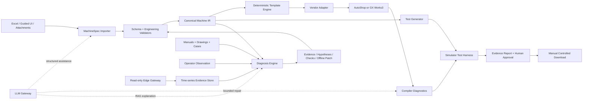
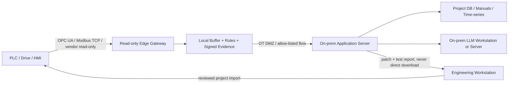

# Product Architecture and Technical Stack

## 1. 设计原则

- **规格优先**：代码是设备规格的派生物，不是唯一真源。
- **确定性核心**：I/O 映射、状态机骨架、报警、互锁和测试由规则与版本化模板生成。
- **LLM 受约束**：用于自然语言理解、歧义检查、检索解释和受控补丁，不拥有直接下载权限。
- **厂商验证**：开放工具只做前置检查，最终以目标厂商编译器、模拟器和真机分级验收。
- **诊断证据化**：每个结论显示来源、时间窗、设备版本、置信度和下一步验证动作。
- **安全隔离**：生成环境、诊断采集环境和生产控制环境分层；首版采集只读。

## 2. 总体架构

## 3. 推荐技术栈

| 层 | 首选 | 理由与边界 |
|---|---|---|
| Web 前端 | React + TypeScript | 表格、流程、差异和证据展示生态成熟 |
| 本地桌面封装 | Tauri（可后置） | 需要访问 Windows 厂商软件时适合；早期先用浏览器 + 本地服务 |
| 后端/API | Python 3.12 + FastAPI | 数据、LLM、文档解析和自动化生态好 |
| 数据契约 | Pydantic v2 + JSON Schema | 严格校验、版本迁移、前后端共享 |
| 关系数据 | PostgreSQL；单机原型 SQLite | 项目、版本、审批、追踪关系 |
| 文件/产物 | 本地对象目录或 MinIO | 工程文件、手册、截图、测试报告按哈希保存 |
| 时序数据 | 首版 Parquet/SQLite；规模化后 TimescaleDB | MVP 不必先上大型时序平台 |
| 检索 | PostgreSQL 全文 + pgvector（可选） | 先做版本/型号/章节过滤，再做向量召回 |
| 工作流 | 显式状态机 + 任务队列 | 工业审批更需要可审计状态，不必一开始依赖复杂 Agent 框架 |
| LLM 接口 | OpenAI-compatible gateway | 云端、本地 vLLM/Ollama/企业模型可切换；不绑死具体模型 |
| 模板/代码生成 | Python AST/IR + Jinja2（只渲染） | 先构建类型化 IR，再渲染，避免拼接自由文本 |
| 静态检查 | 自研规则 + IEC Checker（辅助） | IEC Checker 可做部分 ST/PLCopen 规则，不能替代厂商编译 |
| 测试 | pytest + 属性/时序断言 + 厂商模拟器适配器 | 每个生成模块必须有正常、超时、互锁和复位测试 |
| Windows 工具适配 | 优先官方 API/CLI；其次可审计 UI 自动化 | UI 自动化脆弱，应隔离成可替换适配器并锁定版本 |
| 边缘采集 | 小型工业 x86/ARM + 容器化采集服务 | 负责只读协议、缓存、时钟、签名和上传，不强制运行大模型 |

首版不建议把 Dify、LangGraph、Chroma、TDengine 或某一种工业网关框架设为必选底座。它们可以在明确需求出现后加入，但不能代替 MachineSpec、厂商适配器和测试门。

## 4. PLC 程序生成闭环

### 4.1 生成结构

每台设备建议生成以下层次：

- `IO_MAP`：物理地址与语义信号映射；
- `FB_Actuator_*`：气缸、伺服、变频器等经过验证的功能块；
- `FB_Station_*`：工站状态机与动作顺序；
- `FB_AlarmManager`：报警锁存、确认、复位和证据触发；
- `FB_ModeManager`：自动、手动、初始化、暂停、故障恢复；
- `PRG_Main`：调度，不堆叠设备细节；
- `GVL_*`：分域变量、参数和 HMI 接口；
- 追踪注释：每段代码关联 `requirement_id`、`step_id`、模板版本。

LLM 不逐行自由生成全部 ST。它产生结构化计划或有限补丁；经过校验后，由功能块库和状态机生成器形成代码。运动控制指令必须来自目标平台已验证的 PLCopen/厂商库包装层。

### 4.2 验证阶梯

1. Schema 与工程规则检查；
2. ST 语法/风格和静态规则检查；
3. 目标厂商编译；
4. 模拟器正常流程测试；
5. 传感器缺失、卡住、冲突、通信断开、复位和重启等异常注入；
6. 测试变异：有意改反一个条件、删掉一个互锁，确认测试能抓住；
7. 电气工程师差异评审；
8. 受控设备或试验台 FAT；
9. 现场 SAT。

编译错误可交给 LLM 解释并提出最小补丁，但补丁必须重新走完整阶梯。生产程序的自动下载、切换 RUN、清故障和在线强制变量不属于 Agent 权限。

## 5. 厂商适配策略

### 5.1 汇川 H5U + AutoShop：业务优先、接口有风险

汇川适合苏州非标自动化市场，也符合用户现有合作圈。H5U、EtherCAT 和 PLCopen 风格运动控制在官方资料中有依据。公开的 `AutoShopAgentInterface` 提供工作区 JSON、ST、工程配置以及 UI 编译/监控的实验路径。

风险是汇川官方公开资料没有证实稳定的 AutoShop CLI/COM/LSP。第三方项目包含预编译代理，代码完整性和商业分发边界需审查。因此采用“先做两周适配器技术验证，再决定是否投入正式产品”的策略。

### 5.2 三菱 FX5U + GX Works3：闭环备选

GX Works3 支持 ST 和模拟器；MX Component 可与 GX Simulator3 通信并读写变量，适合自动驱动测试。最大未决项是工程和代码能否通过官方接口稳定自动导入。即使保留一次人工导入，它仍可能比脆弱的 UI 自动化更早形成可信测试闭环。

### 5.3 CODESYS：参考实现与实验后端

CODESYS 官方 MCP 已能读取工程、编辑 ST POU、编译和返回错误，官方 Scripting 也支持命令行运行脚本；这是适配器设计的标杆。它可以用于验证 Agent 工作流，但不能据此推断 InoProShop 或其他定制 IDE 具有相同接口。社区 MCP 仅作为实验工具，使用前要审查版本、自动保存和无撤销等行为。

### 5.4 开源软 PLC：前置测试，不做最终裁判

Beremiz、MatIEC、OpenPLC 和 IEC Checker 可用于语法、规则、快速仿真或 CI，但商业 PLC 的 ST 方言、任务调度、运动库、保持变量和边界行为并不完全相同。开放后端通过只能减少早期错误，不能证明目标厂商工程可用。

## 6. 故障诊断闭环

### 6.1 需要的证据包

一次诊断会话固定保存：

- 设备、程序、MachineSpec、固件和知识库版本；
- 当前模式、整机状态、工站步骤；
- 5–30 秒可配置的命令/反馈/报警/通信时序；
- 伺服或变频器故障码、状态字及对象映射来源；
- 操作员观察、照片/视频和最近变更；
- 已执行的检查及结果；
- 时间同步质量和缺失数据说明。

故障码只能定位设备层面的报警含义。例如 CiA 402 的 `0x603F` 和 `0x6041` 可提供驱动故障码与状态字，但真正根因仍需要知道工艺步骤、命令是否发出、机械是否卡住、使能链与通信是否正常，以及具体厂商对象实现。

### 6.2 诊断级别

- L0：精确型号/版本手册中的故障码解释；
- L1：基于 MachineSpec、互锁和状态机的规则诊断；
- L2：时序相关、同类历史案例与候选根因排序；
- L3：有足够标注历史数据后做异常趋势和预测维护。

首版只承诺 L0–L1，并在少量真实案例中验证 L2。不能在没有历史数据时宣传预测性维护。

### 6.3 自动修复边界

诊断 Agent 可以：指出证据不足、给出安全的检查顺序、生成仪表/监控清单、在离线分支提出最小代码差异、生成回归测试。它不能：绕过安全回路、在线强制输出、自动下载、自动清除未知故障后恢复生产。

## 7. 边缘盒与私有化部署

首选读数路径是 PLC 已暴露的 OPC UA 或明确寄存器/变量协议。OPC UA 支持认证、签名、加密和审计，并可配置只读角色。Modbus TCP 可用于简单数据，但语义和安全能力较弱，需要白名单、只读功能码和网络隔离。厂商协议适配后置。

被动 EtherCAT 抓包并不是把普通小盒插到一个空网口即可完成。通常需要专用 TAP/监测硬件，并掌握 ESI、PDO 映射和时间同步；它适合高级现场诊断，不适合作为 MVP 的默认采集方式。

采集盒与写程序工具必须物理/逻辑分权：

- 采集盒账号只读，不保存 PLC 下载凭据；
- 外发只允许到固定内网地址，断网时本地循环缓冲；
- 程序产物进入工程工作站，由电气工程师审核和下载；
- 大模型运行在企业内网工作站/服务器，小盒可完全不运行模型；
- 云模型只处理脱敏数据，并由项目策略显式允许。

## 8. 安全与治理

- 安全功能按 ISO 13849/IEC 62061 的企业流程设计与验证，不纳入普通代码自动生成；
- OT 网络按 NIST SP 800-82 的分区、最小通信和默认拒绝原则设计；
- 所有外部工具调用设置 allowlist、超时、工作目录和文件哈希；
- 每次生成、修复、编译、测试、审批和导出都有不可变审计记录；
- 现场日志先做项目级权限和脱敏，再进入知识库；
- 第三方二进制、开源许可证、厂商 EULA 和再分发权必须在商业化前完成审查；
- 输出界面明确标识“建议”“已验证”“已批准”“已部署”，不能混用状态。

